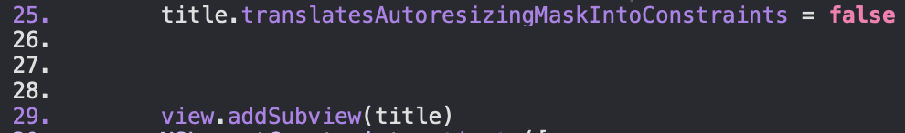

### Ответы на вопросы:

**1. Какие проблемы мешают нам использовать storyboard в реальных проектах?**

   -- Во первых, он очень громоздкий, при увеличении количества элеметов на сториборде в нем все сложнее становится разбираться. 
   
   -- Во вторых, сториборд менее гибкий и удобный, в сравнении с кодом.

   -- Так же я заметил, что в сториборде очень много лишнего, куча различных параметров, которые могут не использоваться в проекте, но мешать пониманию объектов. Тот же код - просто текст, который гораздо легче читать. Да и проверять готовый код становится сложнее

   -- Кроме того, при работе с гитом и другими СУВ сложно проводить code-review

   -- Да и вообще, использовать подобные визуалы для программирования - кринж :)

**2. Что делает код на строках 25 и 29?**

  
 - 25 строка запрещает использовать UIKit auto-resizing для объекта, что помогает избежать некоторх конфликтов
 - 29 строка добавляет subview для view, тут вроде все понятно. Таким образом мы можем не только добавлять view на экран, но и создавать кастомные, например, customSlider

**3. Что такое safe area layout guide?**

По сути - свободная область между верхним и нижним layout. 

**4. Что такое [weak self] на строке 23 и почему это важно?**

Как я понял, weak обозначает слабый захват, чтобы после отработки замыкания место в памяти освободилось и не было утечек памяти.

**5. Что означает clipsToBounds?**

При установке значения в true, представление реально обрезается до своих границ, заданных, например cornerRadius, иначе, оно просто представляется с закругленными углами.

**6. Что такое тип valueChanged? Что такое Void и Double?**

valueChanged - тип, который прослушивает различные объекты на предмет изменения их значения. То есть, в slider этот listener срабатывает когда изменяется значение, двигается ползунок. Void -, как и в других языках, обозначает пустое значение, в swift - (), пустой кортеж. Double - 64-битное число с плавающей точкой.
